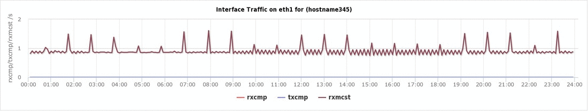

## SARchart / SARgraph (System Activity Report chart/graph) 
 [](https://travis-ci.com/sargraph/sargraph.github.io)

An Online/Offline Tool to view the server's SAR data as charts.

### What is SARchart
SARchart is an online tool to view the performance of a Linux server using the SAR (System Activity Report) output in an impressive graphical chart layout. 

### Provides
This tool displays graphs for single day or multiple days to a server. Also provides information of Peak CPU/Load/Memory/IO in the dashboard. The tool helps you view the charts on CPU, Memory, Load, Run Queue, Swap usage, Processes, Contexts, Interrupts, Paging, Ethernet Devices, Interface traffic, Interface errors, NFS, Sockets etc. of a server in graphical layout. 

### Supports
+ Currently this tool supports the following OS:
  - Linux - RHEL/SuSE/Ubuntu
  - Solaris
  - AIX
  
### Input
This tool expects the input of SAR extracts from the Unix/Linux servers. The SAR extracts depends on the sysstat package.

### Sample Generated charts


### Features

+ Client Interface
We think data protection is important! No data is sent to the server. The magic happens in your browser. This tool uses native javascript and runs only on client browser.

+ Impressive Charts
This tool displays the SAR file output into an impressive graphical chart layout. There is option to zoom in/out the chart, especially needed when data got narrowed down due to screen width.

+ Supports Multiple days input
This tool can plot the charts for single day input as well as multiple days input to a server.

+ Export Charts
This tool allows you to generate and download charts. This feature is not available in this standalone version. Please use the online version in the [website](https://sarchart.dotsuresh.com).


### How to use the tool

The steps involved in generating the SAR Graph are as follows:

1. Create a SAR output as a text file from the Unix server.
  + Login as root or with sudo access run the following commands to fetch the sar output for a specific date. Example:
  ```bash
  #LINUX
  # Generate file for single day:
  sar -A -f /var/log/sa/sa19 > /tmp/sa19_$(hostname).txt
  # Generate file for multiple days files:
  ls /var/log/sa/sa?? | xargs -i sar -A -f {} > /tmp/sar_$(uname -n).txt
  
  # AIX
  # Generate file for single day:
  sar -A -f /var/adm/sa/sa23 > /tmp/sa23_$(uname -n).txt
  # Generate file for multiple days files:
  ls /var/adm/sa/sa?? | xargs -i sar -A -f {} > /tmp/sar_$(uname -n).txt
  
  # SOLARIS
  # Generate file for single day:
  sar -A -f /var/log/sysstat/sa23 > /tmp/sa23_$(uname -n).txt
  # Generate file for multiple days files:
  ls /var/log/sysstat/sa?? | xargs -i sar -A -f {} > /tmp/sar_$(uname -n).txt
  ```
2. Download the SAR text file to the desktop
  + Use any SCP software like Winscp or pscp to download the file from the server. I prefer pscp command to download the files from Unix server to the desktop. Example:
  ```batch
  pscp suresh@hostname143:/tmp/sa19_hostname143.txt .
  ```
3. Upload the SAR text file to this site.
  + Navigate on to the [SARchart](https://sarchart.dotsuresh.com). Just click or drag your file to the upload section of the site.
4. The site will create all the charts.
  + That's all folks! the charts are ready for viewing. 
  + Kindly star this repository if you found this interesting.
  
## OS Platform supported
+ Currently the output is tested in the following OS: Linux (RHEL/SuSE/Ubuntu), AIX, Solaris
+ Planning to include other OS in future

## How to run this offline
- Clone/Download this repository
- Run `npm install`
- `npm start` to run or `npm run dev` to run nodemon
- The site will be available on default port 3000. http://localhost:3000/
- Enjoy!

## Website Links
[SAR Chart](https://sarchart.dotsuresh.com)

## Contributors
- [Adam Kaminski - @thimslugga](https://github.com/thimslugga) - 2022-08-16 added Dockerfile and justfile

## Author
[Suresh Raju](https://dotsuresh.com)<br>
copyright 2016 - 2022
